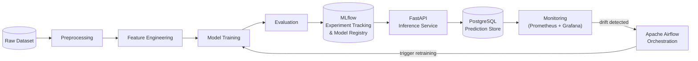

# Customer Churn Prediction & MLOps Platform

> **Status: Under Active Development — Milestone 1 of 12**

---

## Overview

This project builds a **production-grade, end-to-end Machine Learning platform** for predicting customer churn. The platform goes well beyond a notebook experiment: it is designed to train, version, serve, monitor, and automatically retrain a churn-prediction model in a manner consistent with real-world MLOps practices.

The system is structured around a clear separation of concerns:

- **Offline pipeline** — data ingestion, preprocessing, feature engineering, and model training are orchestrated by Apache Airflow and tracked with MLflow.
- **Online serving** — a FastAPI inference service exposes the trained model via a REST API, backed by a PostgreSQL database for prediction logging.
- **Observability** — Prometheus and Grafana provide real-time dashboards for model performance, data drift, and infrastructure health.
- **Quality gates** — automated tests (Pytest), linting (Ruff, Black), and GitHub Actions CI/CD ensure that every change is validated before deployment.

---

## Planned Architecture



> All components shown above are **planned**. See the milestone table below for current status.

---

## Planned Technology Stack

| Category              | Technology                          |
|-----------------------|-------------------------------------|
| Language              | Python 3.11+                        |
| Data processing       | Pandas, NumPy                       |
| ML                    | Scikit-learn, XGBoost, SHAP         |
| Experiment tracking   | MLflow                              |
| Model serving         | FastAPI, Uvicorn                    |
| Data validation       | Pydantic, pydantic-settings         |
| Database              | PostgreSQL, SQLAlchemy, Alembic     |
| Orchestration         | Apache Airflow                      |
| Monitoring            | Prometheus, Grafana                 |
| Containerisation      | Docker, Docker Compose              |
| Testing               | Pytest, HTTPX                       |
| Linting / formatting  | Ruff, Black, pre-commit             |
| CI/CD                 | GitHub Actions                      |

---

## Current Milestone

### ✅ Milestone 1 — Project Initialisation

- Project directory scaffold
- Python virtual environment setup (venv + pip)
- `requirements.txt` with pinned, compatible dependencies
- `pyproject.toml` with Ruff, Black, and Pytest configuration
- `app/core/config.py` — centralised settings via pydantic-settings
- `app/core/logging.py` — reusable stdlib logging configuration
- `data/README.md` — data directory conventions
- `.env.example` — environment variable template (no secrets)
- `.gitignore` — comprehensive Python/ML exclusions
- `tests/unit/test_config.py` — configuration smoke tests

---

## Future Milestones

| # | Milestone                              |
|---|----------------------------------------|
| 2 | Data Acquisition & Exploratory Data Analysis |
| 3 | Preprocessing & Feature Engineering   |
| 4 | Model Training & Benchmarking          |
| 5 | MLflow Experiment Tracking             |
| 6 | Model Registry                         |
| 7 | FastAPI Inference Service              |
| 8 | PostgreSQL Integration                 |
| 9 | Dockerisation                          |
|10 | Airflow Orchestration                  |
|11 | Monitoring & Drift Detection           |
|12 | Automated Retraining                   |
|13 | Testing & CI/CD                        |

---

## Getting Started

### Prerequisites

- Python 3.11 or higher
- Git

### Setup (Windows / Linux / macOS)

```bash
# 1. Clone the repository
git clone <repository-url>
cd customer-churn-mlops

# 2. Create a virtual environment
#    Windows:
python -m venv .venv
.venv\Scripts\activate

#    Linux / macOS:
python3 -m venv .venv
source .venv/bin/activate

# 3. Install dependencies
pip install -r requirements.txt

# 4. Copy and fill in environment variables
cp .env.example .env
# Edit .env with your actual values (never commit .env)

# 5. Run the test suite
pytest
```

### Code Quality

```bash
# Lint
ruff check .

# Format
black .

# Both (via pre-commit after setup)
pre-commit run --all-files
```

---

## Project Structure

```
customer-churn-mlops/
├── app/                    # Application source (API, config, DB, ML)
│   ├── api/                # FastAPI routes and Pydantic schemas
│   ├── core/               # Config, logging, shared utilities
│   ├── db/                 # SQLAlchemy models and Alembic migrations
│   └── ml/                 # Model loading and inference helpers
├── src/
│   └── training/           # Offline training pipeline
├── data/
│   ├── raw/                # Unmodified source data (gitignored)
│   ├── processed/          # Derived datasets (gitignored)
│   └── README.md
├── notebooks/              # EDA and experimentation notebooks
├── tests/
│   ├── unit/               # Fast, isolated unit tests
│   ├── integration/        # Tests requiring live infrastructure
│   └── api/                # End-to-end API tests
├── configs/                # YAML/JSON runtime configs
├── dags/                   # Airflow DAG definitions (churn_training_dag.py)
├── Dockerfile.airflow      # Apache Airflow container definition
├── monitoring/             # Prometheus / Grafana configs
├── docker/                 # Dockerfiles
├── .github/workflows/      # GitHub Actions CI/CD
├── .env.example
├── .gitignore
├── pyproject.toml
├── requirements.txt
└── README.md
```

---

## Apache Airflow Orchestration (Milestone 8)

The project includes an Apache Airflow 2.10.2 orchestration layer running in Docker with `LocalExecutor` and a dedicated PostgreSQL metadata database (`airflow_db`).

### Architecture & Service Summary

- **DAG ID**: `customer_churn_training_pipeline` (`dags/churn_training_dag.py`)
- **Workflow**:
  1. `validate_raw_data`: Loads `data/raw/Telco-Customer-Churn.csv` and executes data-quality checks. If unexpected validation errors occur, the task fails and halts execution.
  2. `train_and_benchmark`: Only runs after validation passes. Executes preprocessing, candidate model training (Logistic Regression, Random Forest, XGBoost), validation benchmarking, test set evaluation, and MLflow model registration.
- **Triggering & Schedule**: Manual only (`schedule=None`), `catchup=False`, `max_active_runs=1`.

### Starting the Services

```bash
# Start PostgreSQL, FastAPI, and Airflow services (runs database provisioning automatically)
docker compose up -d

# Verify all containers are healthy
docker compose ps
```

### Accessing the Airflow UI

- **URL**: [http://127.0.0.1:8080](http://127.0.0.1:8080)
- **Authentication**: Configured via `_AIRFLOW_WWW_USER_USERNAME` and `_AIRFLOW_WWW_USER_PASSWORD` in `.env` (defaults to safe local development credentials `airflow_admin` / `airflow_dev_password`; insecure defaults such as `admin`/`admin` are strictly rejected by the initialization service).

### Dedicated Database Isolation

- **Metadata Storage**: Airflow connects to dedicated database `airflow_db` using isolated role `airflow_user`.
- **Application Security**: `airflow_user` has zero privileges on application database `churn_db` (CONNECT is explicitly revoked), preventing any cross-database access or leakage.
- **Application Storage**: FastAPI continues to use dedicated user `churn_user` on `churn_db`.

### Triggering the DAG Manually

- **Via Web UI**: Navigate to `customer_churn_training_pipeline` in the DAGs list and click the **Trigger DAG** button (Play icon).
- **Via CLI**:
  ```bash
  docker compose exec airflow-webserver airflow dags trigger customer_churn_training_pipeline
  ```

### Dataset Prerequisites

Ensure `data/raw/Telco-Customer-Churn.csv` is present before triggering training:
```bash
# Verify raw dataset exists on host
ls -l data/raw/Telco-Customer-Churn.csv
```
The raw dataset directory is mounted read-only into `/opt/airflow/data`.

### Viewing Task Logs & Troubleshooting

- **In the UI**: Click on the active DAG run -> select a task (`validate_raw_data` or `train_and_benchmark`) -> click **Logs**.
- **In the Terminal**:
  ```bash
  # Follow scheduler logs
  docker compose logs -f airflow-scheduler

  # Follow webserver logs
  docker compose logs -f airflow-webserver
  ```

### Isolated MLflow Experiment Tracking

Airflow training runs are strictly isolated from the production FastAPI model store:
- **Storage Location**: Persistent Docker volume `churn_airflow_mlflow_data` mounted at `/opt/airflow/mlflow`.
  - SQLite tracking database: `/opt/airflow/mlflow/airflow_mlflow.db`
  - Artifact storage: `/opt/airflow/mlflow/artifacts`
- **Why Airflow models do not automatically update the API**:
  The production FastAPI service serves a pinned, verified model version (`churn-predictor:1`) from its own immutable container image store. New candidate models registered by Airflow into the isolated tracking database require explicit review, benchmarking verification, and promotion before being served by the API. This prevents training race conditions, database file-locking collisions on SQLite, and unintended production deployments.

---

## Contributing

This project follows [PEP 8](https://peps.python.org/pep-0008/) style guidelines enforced by Ruff and Black. Please ensure all tests pass and linting is clean before opening a pull request.

---

## Licence

MIT
