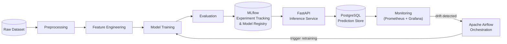

# Customer Churn Prediction & MLOps Platform

> **Status: Under Active Development — Milestone 1 of 12**

---

## Overview

This project builds a **production-grade, end-to-end Machine Learning platform** for predicting customer churn. The platform goes well beyond a notebook experiment: it is designed to train, version, serve, monitor, and automatically retrain a churn-prediction model in a manner consistent with real-world MLOps practices.

The system is structured around a clear separation of concerns:

- **Offline pipeline** — data ingestion, preprocessing, feature engineering, and model training are orchestrated by Apache Airflow and tracked with MLflow.
- **Online serving** — a FastAPI inference service exposes the trained model via a REST API, backed by a PostgreSQL database for prediction logging.
- **Observability** — Prometheus and Grafana provide real-time dashboards for model performance, data drift, and infrastructure health.
- **Quality gates** — automated tests (Pytest), linting (Ruff, Black), and GitHub Actions CI/CD ensure that every change is validated before deployment.

---

## Planned Architecture



> All components shown above are **planned**. See the milestone table below for current status.

---

## Planned Technology Stack

| Category              | Technology                          |
|-----------------------|-------------------------------------|
| Language              | Python 3.11+                        |
| Data processing       | Pandas, NumPy                       |
| ML                    | Scikit-learn, XGBoost, SHAP         |
| Experiment tracking   | MLflow                              |
| Model serving         | FastAPI, Uvicorn                    |
| Data validation       | Pydantic, pydantic-settings         |
| Database              | PostgreSQL, SQLAlchemy, Alembic     |
| Orchestration         | Apache Airflow                      |
| Monitoring            | Prometheus, Grafana                 |
| Containerisation      | Docker, Docker Compose              |
| Testing               | Pytest, HTTPX                       |
| Linting / formatting  | Ruff, Black, pre-commit             |
| CI/CD                 | GitHub Actions                      |

---

## Current Milestone

### ✅ Milestone 1 — Project Initialisation

- Project directory scaffold
- Python virtual environment setup (venv + pip)
- `requirements.txt` with pinned, compatible dependencies
- `pyproject.toml` with Ruff, Black, and Pytest configuration
- `app/core/config.py` — centralised settings via pydantic-settings
- `app/core/logging.py` — reusable stdlib logging configuration
- `data/README.md` — data directory conventions
- `.env.example` — environment variable template (no secrets)
- `.gitignore` — comprehensive Python/ML exclusions
- `tests/unit/test_config.py` — configuration smoke tests

---

## Future Milestones

| # | Milestone                              |
|---|----------------------------------------|
| 2 | Data Acquisition & Exploratory Data Analysis |
| 3 | Preprocessing & Feature Engineering   |
| 4 | Model Training & Benchmarking          |
| 5 | MLflow Experiment Tracking             |
| 6 | Model Registry                         |
| 7 | FastAPI Inference Service              |
| 8 | PostgreSQL Integration                 |
| 9 | Dockerisation                          |
|10 | Airflow Orchestration                  |
|11 | Monitoring & Drift Detection           |
|12 | Automated Retraining                   |
|13 | Testing & CI/CD                        |

---

## Getting Started

### Prerequisites

- Python 3.11 or higher
- Git

### Setup (Windows / Linux / macOS)

```bash
# 1. Clone the repository
git clone <repository-url>
cd customer-churn-mlops

# 2. Create a virtual environment
#    Windows:
python -m venv .venv
.venv\Scripts\activate

#    Linux / macOS:
python3 -m venv .venv
source .venv/bin/activate

# 3. Install dependencies
pip install -r requirements.txt

# 4. Copy and fill in environment variables
cp .env.example .env
# Edit .env with your actual values (never commit .env)

# 5. Run the test suite
pytest
```

### Code Quality

```bash
# Lint
ruff check .

# Format
black .

# Both (via pre-commit after setup)
pre-commit run --all-files
```

---

## Project Structure

```
customer-churn-mlops/
├── app/                    # Application source (API, config, DB, ML)
│   ├── api/                # FastAPI routes and Pydantic schemas
│   ├── core/               # Config, logging, shared utilities
│   ├── db/                 # SQLAlchemy models and Alembic migrations
│   └── ml/                 # Model loading and inference helpers
├── src/
│   └── training/           # Offline training pipeline
├── data/
│   ├── raw/                # Unmodified source data (gitignored)
│   ├── processed/          # Derived datasets (gitignored)
│   └── README.md
├── notebooks/              # EDA and experimentation notebooks
├── tests/
│   ├── unit/               # Fast, isolated unit tests
│   ├── integration/        # Tests requiring live infrastructure
│   └── api/                # End-to-end API tests
├── configs/                # YAML/JSON runtime configs
├── airflow/dags/           # Airflow DAG definitions
├── monitoring/             # Prometheus / Grafana configs
├── docker/                 # Dockerfiles
├── .github/workflows/      # GitHub Actions CI/CD
├── .env.example
├── .gitignore
├── pyproject.toml
├── requirements.txt
└── README.md
```

---

## Contributing

This project follows [PEP 8](https://peps.python.org/pep-0008/) style guidelines enforced by Ruff and Black. Please ensure all tests pass and linting is clean before opening a pull request.

---

## Licence

MIT
